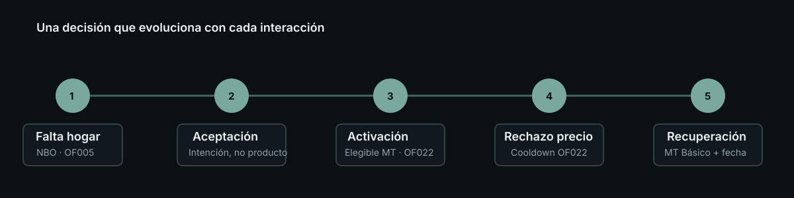
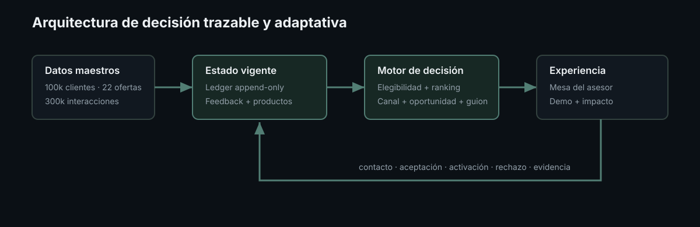

# Closed-Loop Next Best Offer para Movistar Total

Motor reproducible de Next Best Action que reconstruye el estado vigente de cada cliente, prioriza su ruta hacia Movistar Total, recomienda una oferta y un canal, entrega un guion comercial y aprende operacionalmente de contactos, rechazos, aceptaciones y activaciones.

[](https://github.com/JLtz00/Proyecto/actions/workflows/ci.yml)

> **De una oferta estática a una decisión que evoluciona con cada interacción comercial.**



## Para el jurado

El diferencial no es únicamente ordenar ofertas. El sistema reconstruye el estado, evita productos incompatibles o activos, acompaña al asesor, conserva evidencia y vuelve a decidir después del resultado real.

- Demo guiada y no persistente: `streamlit run streamlit_app.py`, vista **Demo guiada**.
- Video subtitulado de 75 segundos: [ver demo MP4](assets/demo_jury.mp4).
- Pitch de tres minutos: [guion](docs/pitch_3_minutos.md).
- Capturas reales: [estado inicial](assets/screenshots/demo-inicio.png), [activación](assets/screenshots/demo-activacion.png) e [impacto](assets/screenshots/impacto-evidencia.png); [guía reproducible](docs/capturas_demo.md).
- Evidencia completa: [evaluación offline v3](reports/evaluation_v3.md).
- Preguntas técnicas: [respuestas para el jurado](docs/preguntas_jurado.md).
- Despliegue público: [guía para Streamlit Community Cloud](docs/despliegue_streamlit.md).

Resultados defendibles:

| Evidencia | Resultado |
|---|---:|
| Ranking v3 Hit@1, universo evaluable | 12.30% |
| Ranking v3 Hit@3, universo evaluable | 36.56% |
| Ranking v3 NDCG@3, universo evaluable | 0.2596 |
| Mejora NDCG@3 frente al baseline comparable | 17.46% |
| Cobertura de aceptaciones evaluables | 82.89% |
| NDCG@3 absoluto sobre todas las aceptaciones | 0.2151 |
| Ofertas distintas en Top 1 | 16 |

Las métricas son offline y observacionales. El sistema no afirma uplift, ventas incrementales ni reducción causal de churn.



El repositorio incluye:

- Los tres CSV originales usados por el proyecto.
- Código completo de validación, features, entrenamiento, evaluación e inferencia.
- `nbo_v2` preentrenado para probar el sistema inmediatamente.
- API FastAPI `1.5.0`.
- Mesa comercial Streamlit para el asesor.
- Persistencia SQLite para decisiones, feedback y eventos.
- Pruebas automatizadas y casos de demostración reproducibles.

> El score se usa para ordenar candidatos y no representa una probabilidad. Las probabilidades orientan la conversación, pero no garantizan contacto, aceptación ni venta. La evaluación observacional no demuestra causalidad.

## 1. Dos formas de ejecutar el proyecto

### Ruta rápida: usar el modelo preentrenado

Esta es la opción recomendada para evaluadores, demostraciones y revisión funcional. No requiere reentrenar.

```powershell
git clone https://github.com/JLtz00/Proyecto.git
cd Proyecto

python -m venv .venv
.venv\Scripts\Activate.ps1
python -m pip install --upgrade pip
python -m pip install -r requirements-dev.lock
python -m pip install -e . --no-deps

nbo-check
streamlit run streamlit_app.py
```

Abrir `http://localhost:8501`.

La Mesa comercial usa el **Motor local** de forma predeterminada, por lo que no es necesario iniciar FastAPI para probar clientes, registrar resultados o confirmar activaciones.

En Linux o macOS, la activación del entorno cambia a:

```bash
source .venv/bin/activate
```

### Ruta reproducible: entrenar desde los CSV

Esta ruta demuestra que los artefactos pueden reconstruirse desde los datos originales:

```powershell
git clone https://github.com/JLtz00/Proyecto.git
cd Proyecto

python -m venv .venv
.venv\Scripts\Activate.ps1
python -m pip install --upgrade pip
python -m pip install -r requirements-dev.lock
python -m pip install -e . --no-deps

python -m nbo.training
nbo-check
pytest
streamlit run streamlit_app.py
```

El entrenamiento:

1. Lee y valida los tres CSV originales.
2. Construye acumulados históricos usando únicamente meses anteriores al evento.
3. Separa clientes en train, validación y test con semilla reproducible.
4. Compara CatBoost con fallbacks jerárquicos.
5. Aplica gates de calibración y robustez temporal.
6. Entrena contacto, aceptación y motivo de rechazo.
7. Escribe una nueva versión en `artifacts/nbo_v2/`.
8. Actualiza `artifacts/current.json` con una ruta relativa y portátil.

El entrenamiento completo puede tardar más de 10 minutos y, según CPU y memoria, extenderse considerablemente. No se necesita GPU. Para comprobar el pipeline antes de iniciar esa ejecución, usar `--quick`.

Para verificar rápidamente el pipeline de entrenamiento sin reemplazar conceptualmente el champion oficial:

```powershell
python -m nbo.training --quick
nbo-check
```

Este modo mantiene la construcción leakage-safe, pero usa 6,000 filas de entrenamiento, un trial y cinco iteraciones. Genera `artifacts/nbo_smoke/`, lo marca con `quick_mode: true` y lo activa temporalmente en `current.json`. No debe usarse para reportar métricas finales. Para volver al modelo incluido, cambiar el manifiesto a `nbo_v2` o ejecutar el entrenamiento completo.

## 2. Requisitos

- Python 3.11 o posterior.
- Aproximadamente 1 GB libre para instalación, cachés y artefactos temporales.
- Git.
- Windows, Linux o macOS.

Dependencias principales:

- pandas y NumPy para datos.
- scikit-learn y CatBoost para modelado.
- FastAPI y Uvicorn para la API.
- Streamlit para la Mesa comercial.
- SQLite, incluido con Python, para persistencia local.

SHAP independiente es opcional:

```powershell
python -m pip install -e ".[dev,explain]"
```

## 3. Datos incluidos

El motor utiliza exclusivamente los archivos de `dataset/`:

| Archivo | Contenido |
|---|---|
| `dataset_clientes.csv` | Perfil maestro de 100,000 clientes |
| `catalogo_ofertas_entrega.csv` | Catálogo de 22 ofertas |
| `historial_campanias.csv` | 300,112 interacciones comerciales históricas |

Los archivos maestros nunca se modifican durante inferencia, feedback o activación. El estado operacional se almacena como eventos append-only en SQLite.

Los CSV `*_limpio.csv` de la raíz pertenecen al trabajo exploratorio y no se usan para entrenar el motor, ya que sus agregados globales podrían introducir fuga de información.

## 4. Artefactos preentrenados

La ruta rápida utiliza los siguientes archivos versionados:

```text
artifacts/
├── current.json
└── nbo_v2/
    ├── contact.joblib
    ├── acceptance.joblib
    ├── rejection.joblib
    ├── metadata.json
    ├── feature_schema.json
    ├── split_manifest.json
    ├── ranking_weights.json
    ├── audit.json
    └── MODEL_CARD.md
```

El conjunto completo pesa aproximadamente 2.56 MB, por lo que se distribuye directamente con el repositorio y no requiere Git LFS.

`artifacts/current.json` contiene una ruta relativa:

```json
{
  "version": "nbo_v2",
  "path": "nbo_v2"
}
```

Esto permite mover o clonar el proyecto en cualquier directorio. SQLite, logs, reportes y exportaciones generadas continúan ignorados por Git.

## 5. Verificar una instalación

Después de instalar el proyecto, ejecutar:

```powershell
nbo-check
```

Equivalente sin el comando instalado:

```powershell
python -m nbo.bootstrap
```

La verificación comprueba:

- Presencia de los tres datasets.
- Manifiesto portátil.
- Artefactos requeridos.
- Carga de `nbo_v2`.
- Recomendación para `CLI000001`, `CLI000013` y `CLI000018`.

Debe terminar con `"ready": true`.

## 6. Aplicación para asesor y jurado

Iniciar con:

```powershell
streamlit run streamlit_app.py
```

La aplicación contiene tres vistas con responsabilidades separadas:

- **Demo guiada:** recorrido aislado y reiniciable para explicar el closed loop en 90 segundos.
- **Mesa del asesor:** consulta y operación persistente en entornos locales o controlados.
- **Impacto y evidencia:** funnel, MT, canales, objeciones, economía y evaluación offline.

Incluye:

- Estado y etapa actual del cliente.
- Oferta, canal, precio, momento y prioridad.
- Propensión contextual, soporte histórico y venta estimada.
- Objetivo comercial y siguiente paso.
- Guion con apertura, pregunta, argumento, beneficio y cierre.
- Objeciones probables y respuesta sugerida.
- Razones positivas, precauciones y evidencia.
- Rebate y alternativas elegibles.
- Servicios activos y perfil operacional completo.
- Confianza, soporte histórico, ranking y versiones.
- Registro de contacto, aceptación, rechazo o no contacto.
- Motivo de rechazo, evidencia y resultado de rebate.
- Confirmación de activación.
- Recálculo inmediato de la nueva NBO.
- Historial de eventos operacionales.

La estética usa colores oscuros y tranquilos, sin degradados y con uso limitado de contenedores.

En despliegue público, establecer `NBO_PUBLIC_DEMO=true` oculta la operación persistente y deja únicamente demo y evidencia. Cada recorrido de demo es aislado por sesión y nunca escribe en SQLite.

### Casos de referencia

| Cliente | Estado inicial esperado | Recomendación demostrativa |
|---|---|---|
| `CLI000001` | Falta internet hogar | `OF005`, completar hogar y habilitar MT |
| `CLI000013` | Elegible para MT | `OF022`, propuesta Movistar Total |
| `CLI000018` | Ya posee MT | Oferta compatible sin duplicar MT |

Estos clientes aparecen como accesos rápidos en la barra lateral.

### Motor local y API remota

En **Conexión** existen dos opciones:

- `Motor local`: predeterminada. Carga `nbo_v2` directamente y no requiere Uvicorn.
- `API remota`: usa una API FastAPI activa y compatible con versión `1.5.0`.

Si se elige API remota:

```powershell
uvicorn nbo.api:app --reload
```

Luego verificar `http://127.0.0.1:8000/health`.

## 7. API FastAPI

Iniciar:

```powershell
uvicorn nbo.api:app --host 0.0.0.0 --port 8000
```

Documentación interactiva:

- Swagger UI: `http://127.0.0.1:8000/docs`
- OpenAPI: `http://127.0.0.1:8000/openapi.json`
- Health: `http://127.0.0.1:8000/health`

Endpoints principales:

| Método y ruta | Función |
|---|---|
| `POST /api/v1/nbo/recommend` | Genera y persiste una recomendación operacional |
| `POST /api/v1/nbo/batch` | Recomienda para hasta 1,000 clientes |
| `POST /api/v1/nbo/feedback` | Registra resultado final y rebate |
| `POST /api/v1/nbo/events` | Registra eventos del funnel comercial |
| `GET /api/v1/nbo/decisions/{decision_id}` | Recupera una decisión trazable |
| `POST /api/v1/nbo/customer-events` | Modifica el estado mediante un evento append-only |
| `GET /api/v1/nbo/customer-state/{cliente_id}` | Reconstruye el estado actual o histórico |
| `GET /api/v1/nbo/customer-state/{cliente_id}/events` | Lista eventos operacionales |
| `GET /api/v1/nbo/learning/readiness` | Evalúa soporte para entrenar un challenger |
| `GET /api/v1/nbo/metrics` | Devuelve métricas operacionales |
| `GET /api/v1/nbo/executive-report?source=operational\|demo` | Funnel ejecutivo sin mezclar operación y simulación |
| `POST /api/v1/nbo/simulate` | Ejecuta escenarios sin persistencia |
| `POST /api/v1/nbo/demo/journey` | Reproduce el recorrido adaptativo |
| `POST /api/v1/nbo/economics/simulate` | Calcula valor esperado con supuestos explícitos |
| `POST /api/v1/nbo/playbook/render` | Renderiza el guion o usa fallback seguro |

Ejemplo de recomendación:

```powershell
Invoke-RestMethod -Method Post http://127.0.0.1:8000/api/v1/nbo/recommend `
  -ContentType application/json `
  -Body '{"cliente_id":"CLI000001"}'
```

## 8. Closed loop operacional

El sistema separa intención comercial y estado efectivo:

```text
perfil maestro
    + eventos operacionales vigentes
    + comportamiento posterior a ofertas
                ↓
estado consolidado
                ↓
elegibilidad + probabilidades + ranking
                ↓
NBO + playbook
                ↓
contacto → aceptación/rechazo → activación
                ↓
nuevo estado y nueva NBO
```

Una aceptación no cambia productos. `product_activated` exige evidencia y es el evento que modifica servicios. Cuando contiene un `decision_id`, valida que:

- La decisión pertenece al cliente.
- La oferta estaba entre sus candidatos.
- Existe aceptación previa.
- La versión esperada coincide con el estado actual.

Eventos admitidos:

- `product_activated`.
- `product_cancelled`.
- `usage_updated`.
- `billing_updated`.
- `preferred_channel_changed`.
- `mt_eligibility_overridden`.
- `customer_attribute_corrected`.

Los eventos nunca se editan ni eliminan. Una corrección se registra como un evento compensatorio. Cada evento conserva fuente, evidencia, valores anteriores y nuevos, fecha efectiva, fecha de registro, idempotency key y versiones de estado.

La adaptación inmediata actualiza tasas jerárquicas, afinidad por canal, exposición, rechazo, fatiga y cooldown. No modifica los pesos ni reentrena `nbo_v2`. El reentrenamiento continúa siendo una operación explícita.

## 9. Reglas comerciales principales

- Nunca recomendar una oferta que ya está activa.
- No recomendar otra adquisición MT a quien ya posee MT.
- MT requiere móvil postpago e internet hogar, salvo override con evidencia.
- Si falta internet hogar o móvil postpago, priorizar el producto que completa la ruta MT.
- Upgrades, equipos móviles y roaming requieren servicio móvil.
- Router y upgrade hogar requieren internet hogar.
- Un hogar existente solo admite bundles que amplíen estrictamente sus servicios.
- Streaming y seguridad requieren al menos un servicio activo.
- Un rechazo bloquea la misma oferta durante 14 días y penaliza del día 15 al 30.
- Una alternativa por precio debe conservar la ruta MT.
- Edad y región no se usan para excluir ofertas; solo para auditoría.

Las reglas y versiones están centralizadas en `config/default.yaml`.

## 10. Evaluación y auditoría

Ejecutar:

```powershell
python -m nbo.evaluation --tune-ranking
python -m nbo.evaluation
python -m nbo.evaluation_v3
python -m nbo.audit
```

La evaluación histórica:

- Usa únicamente meses completos anteriores al evento.
- Excluye el evento evaluado y su mes.
- Ignora feedback y eventos operacionales del dashboard.
- Compara contra oferta popular global, por segmento y por canal.
- Reporta Hit@1, Hit@3, NDCG@3, cobertura, diversidad y métricas MT.

La evaluación v3 usa como unidad cada evento aceptado, conserva múltiples eventos del mismo cliente y agrega intervalos bootstrap agrupados por cliente. Obtuvo:

- 14,353 eventos aceptados en test.
- Cobertura evaluable: `82.89%`.
- Hit@1 condicionado: `12.30%`; absoluto: `10.19%`.
- Hit@3 condicionado: `36.56%`; absoluto: `30.30%`.
- NDCG@3 condicionado: `0.2596`; absoluto: `0.2151`.
- Mejora NDCG@3 frente al mejor baseline comparable: `17.46%`.
- IC 95% NDCG@3: `[0.2514, 0.2670]`.
- 16 ofertas diferentes como Top 1; concentración máxima `26.15%`.

La evaluación v2 original permanece disponible para reproducir la comparación histórica que obtuvo `+7.24%` de NDCG@3. La v3 añade cobertura absoluta, unidad por evento, bootstrap, cortes y ablations.

Estas métricas describen ranking offline bajo la política histórica; no prueban uplift ni efecto causal.

## 11. Pruebas automatizadas

Ejecutar toda la suite:

```powershell
pytest
```

Con cobertura:

```powershell
pytest --cov=nbo --cov-report=term-missing
```

La suite cubre:

- Contrato y calidad de datos.
- Fuga temporal.
- Features y reglas.
- Scoring y Top 3.
- Persistencia y migración SQLite.
- Ledger append-only.
- Idempotencia y conflictos de versión.
- Reconstrucción actual e histórica.
- Activación, cancelación y override MT.
- Separación entre aceptación y activación.
- Feedback, funnel, cooldown y fatiga.
- Evaluación histórica aislada.
- API y errores 404, 409, 422 y 503.
- Dashboard vacío, casos de referencia y modo local.
- Demo adaptativa completa.

## 12. Demo adaptativa por CLI

```powershell
python -m nbo.demo --cliente-id CLI000001 --motivo precio
```

Exportar JSON y Markdown:

```powershell
python -m nbo.demo `
  --cliente-id CLI000001 `
  --motivo precio `
  --json-output artifacts/demo.json `
  --markdown-output artifacts/demo.md
```

Recorrido esperado:

```text
CLI000001
→ falta internet hogar
→ recomienda OF005
→ aceptación sin cambio de productos
→ activación confirmada de OF005
→ elegible MT
→ recomienda OF022
→ rechazo por precio
→ cooldown
→ tier MT inferior
→ fecha de recontacto
```

## 13. Batch de clientes

```powershell
python -m nbo.batch --chunk-size 1000 --output artifacts/recomendaciones.csv
python -m nbo.reporting
```

Para una ejecución corta:

```powershell
python -m nbo.batch --limit 100 --output artifacts/batch_smoke.csv
```

Los reportes incluyen cobertura, duración, p50/p95, errores y distribución de ofertas.

## 14. Persistencia y reinicio de demo

La base local se crea en:

```text
artifacts/nbo.sqlite3
```

Contiene decisiones, candidatos, funnel, feedback, exposiciones de playbook, renderizados y eventos de estado. Está ignorada por Git para que cada clon comience con una operación independiente.

Para reiniciar los resultados de una demo local, detener Streamlit y eliminar únicamente `artifacts/nbo.sqlite3`. Al volver a abrir el dashboard, la base se crea nuevamente. No eliminar `artifacts/nbo_v2` ni `artifacts/current.json`.

## 15. Arquitectura

```text
CSV maestros ──→ validación ──→ features leakage-safe ──→ entrenamiento
                                                            │
                                                            ↓
                                                       artefactos nbo_v2
                                                            │
perfil maestro + ledger + feedback ──→ estado vigente ──────┤
                                                            ↓
catálogo × canal ──→ elegibilidad ──→ probabilidades ──→ ranking
                                                            │
                                         ┌──────────────────┴───────────────┐
                                         ↓                                  ↓
                                  FastAPI 1.5.0                     Mesa Streamlit
                                         │                                  │
                                         └──────────→ SQLite ←───────────────┘
```

Componentes:

```text
config/default.yaml          Configuración y versiones
dataset/                     CSV maestros
artifacts/current.json       Manifiesto portátil del champion
artifacts/nbo_v2/            Modelo preentrenado
src/nbo/data.py              Carga y limpieza semántica
src/nbo/validation.py        Contratos de datos
src/nbo/features.py          Features históricas y operacionales
src/nbo/models.py            Modelos, calibradores y fallbacks
src/nbo/training.py          Entrenamiento reproducible
src/nbo/evaluation.py        Evaluación reservada y baselines
src/nbo/rules.py             Elegibilidad y ranking
src/nbo/state.py             Reconstrucción del estado operacional
src/nbo/persistence.py       SQLite y ledger append-only
src/nbo/engine.py            Motor principal NBO
src/nbo/playbook.py          Guion comercial determinista
src/nbo/api.py               API FastAPI
src/nbo/advisor_ui.py        Contratos y formato del dashboard
src/nbo/advisor_local.py     Backend local del dashboard
src/nbo/bootstrap.py         Verificación de instalación
streamlit_app.py             Mesa comercial
tests/                       Pruebas automatizadas
```

## 16. Versiones activas

| Componente | Versión |
|---|---|
| Modelo | `nbo_v2` |
| Features | `features_v2` |
| Reglas | `rules_v5` |
| Playbook | `playbook_v2` |
| Decisión | `decision_v4` |
| Catálogo | `catalog_2026_08` |
| API | `1.5.0` |

El modelo activo no cambia durante la adaptación operacional. Los cambios inmediatos provienen del estado vigente y del comportamiento observado.

## 17. Despliegue

### Streamlit local o servidor interno

```powershell
streamlit run streamlit_app.py --server.address 0.0.0.0 --server.port 8501
```

### Streamlit Community Cloud

El repositorio incluye `requirements.txt`, `runtime.txt`, tema en `.streamlit/config.toml` y modo público aislado. Seguir [la guía de despliegue](docs/despliegue_streamlit.md); la vinculación final de la URL requiere autorización del propietario en Streamlit Cloud.

### API independiente

```powershell
uvicorn nbo.api:app --host 0.0.0.0 --port 8000
```

Para un entorno corporativo deben añadirse autenticación, autorización, HTTPS, secretos gestionados, almacenamiento persistente, backups, monitoreo, límites de concurrencia y una base multiusuario. SQLite y el modo local son apropiados para evaluación, demo y piloto controlado, no para una operación distribuida de alta concurrencia.

## 18. Solución de problemas

### `No hay artefactos entrenados`

Ejecutar:

```powershell
nbo-check
python -m nbo.training
```

Comprobar que existan `artifacts/current.json` y `artifacts/nbo_v2/`.

### `ImportError` después de actualizar el repositorio

Detener procesos antiguos, reinstalar el paquete editable y reiniciar Streamlit:

```powershell
python -m pip install -r requirements-dev.lock
python -m pip install -e . --no-deps
streamlit run streamlit_app.py
```

Cerrar pestañas antiguas del navegador o recargar con `Ctrl+F5`.

### `Not Found` al usar casos de referencia

Usar `Motor local` en el panel **Conexión**. Si se usa `API remota`, verificar:

```powershell
Invoke-RestMethod http://127.0.0.1:8000/health
```

La respuesta debe incluir `"api_version": "1.5.0"`.

### Puerto 8501 ocupado

```powershell
streamlit run streamlit_app.py --server.port 8502
```

### Conflicto de versión 409

Otro evento modificó el estado desde que se generó la pantalla. Volver a consultar el cliente y registrar la operación sobre la versión vigente.

### El dashboard conserva resultados anteriores

Cada recomendación persistida es intencional. Para una demo completamente limpia, seguir la sección **Persistencia y reinicio de demo**.

## 19. Limitaciones y uso responsable

- Los perfiles entregados resumen seis meses y no son snapshots mensuales perfectos.
- La señal histórica individual es limitada; por eso algunos champions son tasas jerárquicas calibradas.
- El precio normalizado es un proxy y no representa margen real.
- No existe target válido para churn ni para éxito causal del rebate.
- No se afirma uplift ni causalidad.
- El LLM opcional solo reformula texto; nunca decide la oferta, canal o score.
- Las condiciones del catálogo pertenecen al dataset del desafío y no deben presentarse como condiciones comerciales oficiales fuera de este contexto.
- Antes de producción se requieren validación con asesores reales, seguridad, observabilidad y gobierno del modelo.

## 20. Publicar cambios del repositorio

Antes de compartir, comprobar que código y artefactos portátiles estén versionados:

```powershell
git status
git add .gitignore README.md pyproject.toml config src tests streamlit_app.py `
  artifacts/current.json artifacts/nbo_v2
git commit -m "Add reproducible closed-loop NBO and advisor dashboard"
git push origin main
```

No versionar:

- `artifacts/nbo.sqlite3`.
- Logs.
- Exportaciones batch.
- Entornos virtuales.
- Cachés de Python.
- Archivos `.env` con secretos.

Después del push, la comprobación final recomendada es clonar en otro directorio y ejecutar exactamente la **Ruta rápida** y luego, cuando se quiera auditar reproducibilidad, la **Ruta reproducible**.
